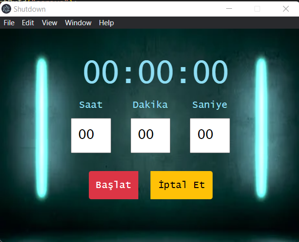

# Shutdown

## Description
This project is an application that allows users to set a shutdown time for their computers. Users can specify a time at which they want their computers to shut down, and once the specified time is reached, the computer will automatically shut down. The project is developed using HTML, CSS (including Bootstrap), and JavaScript. Additionally, it is built as a desktop application using the Electron framework.

### Technologies and Programming Languages Used
- HTML
- CSS (Bootstrap)
- JavaScript
- Electron framework

## Functions
- Users can set the shutdown time by specifying hours, minutes, and seconds.
- Clicking the "Start" button initiates the countdown, and the computer shuts down after the specified time elapses.
- Clicking the "Cancel" button cancels the shutdown process and resets the timer.

### Screenshot of the application

